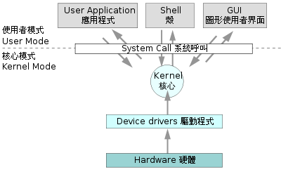

# 第一章 基础知识

## 操作系统
> &emsp;&emsp;操作系统（英语：operating system，縮寫：OS）是管理计算机硬件與软件資源的计算机程序，同时也是计算机系统的核心与基石。操作系统需要处理如管理與配置内存、決定系統資源供需的優先次序、控制輸入與輸出裝置、操作网络與管理文件系统等基本事務。操作系统也提供一個讓使用者與系統互動的操作界面。
&emsp;&emsp;操作系统的型態非常多樣，不同機器安裝的操作系统可從簡單到複雜，可從行動電話的嵌入式系统到超級電腦的大型作業系統。許多操作系统製造者對它涵盖范畴的定义也不尽一致，例如有些操作系统整合了图形用户界面，而有些僅使用命令行界面，而將图形用户界面視為一種非必要的應用程式。
&emsp;&emsp;操作系统理论在计算机科学中，為歷史悠久而又活跃的分支；而操作系统的设计与实现则是软件工业的基础与核心。
——来自[维基百科][1]

&emsp;&emsp;总而言之，所有操作系统都为他们所运行的程序提供服务。典型的服务包括：执行新程序、打开文件、多谢文件、分配内存以及获得时间等。程序通过系统调用，经由操作系统访问硬件资源。

[1]:https://zh.wikipedia.org/wiki/%E6%93%8D%E4%BD%9C%E7%B3%BB%E7%BB%9F