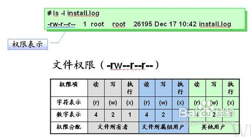

<!--Chapter3.md-->

# 第三章 深入了解Linux

## 3.1 用户管理系统

Linux 是一个可以实现多用户登陆的操作系统，多用户可以同时登陆同一 台主机，共享主机的一些资源，不同的用户也分别有自己的用户空间， 可用于存放各自的文件。

虽然不同用户的文件是放在同一个物理磁盘上的甚至同一个逻辑分区或 者目录里，但是由于 Linux 的用户管理和文件权限机制，不同用户不可 以轻易地查看、修改彼此的文件。

那就先看看我们是谁呗。

### 查看用户

查看当前用户有多种方式可以实现，我们试试下面三种命令：
* $ who am i:只列出用户名 
* $ who mom likes/who am i:列出用户名，所使用终端的编号和开 启时间； 
* $ finger:列出当前用户的详细信息，需使用apt-get提前安装； 实 例：
```
$ who mom likes 
fanghr ttys006  Sat 8 23:58 
$ who am i 
fanghr ttys006  Sat 8 23:58 
# pts/0 中 pts(mac ttys) 表示伪终端,pts/0(ttys006) 后面那个数字就表示打开的伪终端序号 
$ sudo apt-get finger
$ finger # 会列出当前用户的信息 
Login      Name        Tty      Idle  Login Time   Office     Office Phone 
fanghr   fanghr  pts/0         Sat  4 23:04 
(192.168.1.104)
```

### 老大用户root

一般通过上面的操作会发现我们当前登录的用户并非root,在Linux中，老 大root账户拥有整个系统至高无上的权利，它可以操作系统中所有的对 象。

在某些发行版中，这个用户并不显式存在，不过如果其它的用户具有使 用sudo的权利（后文会叙述如何获取），通过sudo 命令也可以达到用 root账号操作的效果。创建用户就是一个需要sudo权限的命令。

#### 创建用户adduser

此命令的使用可参看以下实例：

```
fanghr@ADMIN:/mnt/c/Windows/System32$ sudo adduser student 
[sudo] password for fanghr: 
Adding user `student' ... 
Adding new group `student' (1001) ... 
Adding new user `student' (1001) with group `student' ... 
Creating home directory `/home/student' ... 
Copying files from `/etc/skel' ... 
Enter new UNIX password: 
Retype new UNIX password:
No password supplied 
Enter new UNIX password: 
Retype new UNIX password: 
passwd: password updated successfully 
Changing the user information for student Enter the new value, or press 
ENTER for the default
    Full Name []: 
    Room Number []: 
    Work Phone []:   
    Home Phone []:   
    Other []: 
Is the information correct? [Y/n] 
# finger 用户管理用户 
fanghr@Ubuntu:~$ finger student 
Login: student                    Name: Udacity Linux Student 
Directory: /home/student                Shell: /bin/bash 
Never logged in. 
No mail. 
No Plan.
```

说完了如何添加用户，再说说如何切换用户。

#### 切换用户相关命令：

su <user>:切换到用户user,执行时需要输入目标用户的密码； su <user>:切换用户，同时环境变量也会跟着改变成目标用户的环境变量。 
su -l lilei:切换登录用户;

有时候我们也会看到添加用户使用的命令是useradd,而非adduser下面说说二者的区别： sudo adduser lilei:新建一个叫做lilei的用户，添加用户到系统，同时也会默认为新用户创建 home目录： sudo useradd lilei:只创建用户，创建完了需要用 passwd lilei 去设置新用户的密码;

### 用户组，给用户添加组织

在 Linux 里面每个用户都有一个归属（用户组），用户组简单地理解就是一组用户的集合，它们共享一些资源和权限，同时拥有私有资源。

#### 查看用户属于那些组（groups）：

使用示例：

```
~ groups fanghr
fanghr adm cdrom sudo dip plugdev docker
```

关于用户组我们需要注意：
* 每次新建用户如果不指定用户组的话，默认会自动创建一个与用户名相同的用户组； 
* 默认情况下在 sudo 用户组里的可以使用 sudo 命令获得 root 权限。 
* 使用cat /etc/group | sort命令查看某组包含那些成员:/etc/group文件中分行显示了用户组（Group）、用户组口令、GID 及该用户组所包含的用户（User），格式如下：

```
group_name:password:GID:user_list 
group:*:16: 
interactusers:*:51: 
kmem:*:2:root 
localaccounts:*:61:
# *表示密码不可见 
mail:*:6:_teamsserver
```

#### 为用户添加组织

不同的组对不同的文件可能具有不同的操作权限，比如说通过上述命令新建的用户默认是没有使用sudo的权限的，我们可以使用usermod命令把它加入sudo组用以具备相应的权限。 方法如下：

```
$ sudo usermod -G sudo student 
$ groups lilei 
# lilei:lilei sudo
```

### 删除用户的方法
删除用户也是一个需要管理员权限的命令，使用方法如下：
sudo deluser student --remove-home：删除用户及用户相关文件；
直接的deluser会删除该用户，但是不会删除用户相关文件；

## 3.2文件权限管理
使用Linux的过程中，查看修改文件是我们常做的事情之一。但是正如前文所说，文件是有所有权概念的，对同一个文件并非所有用户都对其有一样的权限。

前面我们提到使用ls命令可以查看文件，ls后还可以带各种参数以实现不同的查看效果，具体如下：

* ls -l:查看文件及其权限; 
* ls -A：显示隐藏文件（包括以.开头的文件）；(a->all) 
* ls -Al:显示隐藏文件及其权限； 
* ls -dl<查看一文件的完整属性>:(d->detail)
* ls -AsSh:显示所有文件大小，并以普通人类能看懂的方式呈现(小 s为显示文件大小，大 S 为按文件大小排序);

示例如下(注：命令行中的~是我所操作的当前目录的名称(home))：
```
fanghr@ADMIN:~$ ls -l 
total 17204 
drwxrwxrwx 2 fanghr fanghr        0 Jul  9 23:20 aalib-1.4p5 
-rw-rw-rw- 1 fanghr fanghr    16718 Aug 17  2013 aalib_1.4p5-41.debian.tar.gz 
-rw-rw-rw- 1 fanghr fanghr     2078 Aug 17  2013 aalib_1.4p5-41.dsc 
-rw-rw-rw- 1 fanghr fanghr   391028 May 12  2004 aalib_1.4p5.orig.tar.gz 
-rwxrwxrwx 1 fanghr fanghr     8573 Jul 18 18:06 a.out 
drwxrwxrwx 2 fanghr fanghr        0 Jul 19 14:16 esp-open-sdk 
-rw-rw-rw- 1 fanghr fanghr    80285 Jul 19 14:05 esp-open-sdk.git 
-rw-rw-rw- 1 fanghr fanghr    12965 Dec 13  2016 install.sh 
-rw-rw-rw- 1 fanghr fanghr       42 Jul 22 10:31 maps 
-rw-rw-rw- 1 fanghr fanghr     9384 Jul 22 10:32 maps?v=1.3 
-rw-rw-rw- 1 fanghr fanghr     9384 Jul 22 10:51 maps?v=1.3.1
drwxrwxrwx 2 fanghr fanghr        0 Jul 16 15:23 markdown2html 
drwxrwxr-x 2 fanghr fanghr        0 Jul 10 14:11 node_modules 
drwxrwxr-x 2 fanghr fanghr        0 Jun 15 19:44 node-v8.1.2-linux-x64
-rwxrwxrwx 1 fanghr fanghr 17047292 Jul 10 14:23 node-v8.1.2-linux-x64.tar.gz 
-rw-rw-rw- 1 fanghr fanghr        0 Jul 16 15:32 out.html 
-rw-rw-rw- 1 fanghr fanghr      102 Jul 18 18:06 test.cpp 
-rwxrwxrwx 1 fanghr fanghr       58 Jul 18 18:16 test.sh 
drwxrwxrwx 2 fanghr fanghr        0 Jul  7 21:42 tetris 
drwxrwxrwx 2 fanghr fanghr        0 Jul 10 14:11 tmp 
# 文件类型和权限 链接数 所有者 用户所在组 大小 最后修改 时间 文件名称
```
上面的代码中，最让人疑惑的可能就是文件类型和权限这一项了，我们 来逐一解释。

### 文件类型

说到文件，不得不提文件类型，Linux中的文件不同于Windows中的文 件，在Linux 里面一切皆文件，主要文件类型有以下几种：

* 普通文件：一般是用一些相关的应用程序创建的（如图像工具、 文档工具、归档工具... 或 cp工具等),这类文件的删除方式是用rm 命令,而创建使用touch命令,用符号-表示； 
* 目录：目录在Linux是一个比较特殊的文件，用字符d表示，删除用rm 或rmdir命令； 
* 块设备文件：存在于/dev目录下，如硬盘，光驱等设备，用字符d 表示; 
* 设备文件：（ /dev 目录下有各种设备文件，大都跟具体的硬件设 备相关），如猫的串口设备，用字符c表示； 
* socket文件;用字符s表示，比如启动MySQL服务器时，产生的 mysql.sock的文件; 
* pipe 管道文件：可以实现两个程序（可以从不同机器上telnet）实 时交互，用字符p表示； 
* 链接文件:软链接等同于 Windows 上的快捷方式；用字符l表示； (软硬链接文件的共同点和区别：无论是修改软链接，硬链接生成 的文件还是直接修改源文件，相应的文件都会改变，但是如果删 除了源文件，硬链接生成的文件依旧存在而软链接生成的文件就 不再有效了。)

### 文件权限

上面的代码示例中，另一个比较让人疑惑的是drwxr-xr-x这样的语句，这 段语句表明了文件的权限。Linux中文件权限主要由以下几种：
* 读权限(r)：可以使用 cat 之类的命令来读取某个文件的内容; 
* 写权限(w)，表示你可以编辑和修改某个文件；
* 执行权限(x)，通常指可以运行的二进制程序文件或者脚本文件 (Linux上不是通过文件后缀名来区分文件的类型);

所有者权限，所属用户组权限，是指你所在的用户组中的所有其它用户 对于该文件的权限。 一个目录同时具有读权限和执行权限才可以打开并 查看内部文件，而一个目录要有写权限才允许在其中创建其它文件，这 是因为目录文件实际保存着该目录里面的文件的列表等信息。 可用下图 加强对文件权限的理解：


#### 修改文件权限的办法

从上图中可以看出，每个文件有三组权限（拥有者，所属用户组，其他 用户，这个顺序是一定的），修改权限的命令是chmod,修改文件权限的 方法有两种,所示：
```
# 用数字的形式表示，数字的来源及计算方法见下文,数字的意 义见下文
$ chmod 700 node # 让用户对node件具备读写权限，所在组 和其它用户都没有读写权限
# 用字母的形式表示，g、o 还有 u 分别表示 group、 others 和 user，+ 和 - 分别表示增加和去掉相应的权限
$ chmod go-rw node # 让用户所属用户组及其它用户这个文 件不再有读写权限
```

文件权限的数字计算方式：

* r对应4，
* w对应2，
* x对应1，
* -对应0，

权限的数字代码即为上述几个值相加，如rw-=4+2+0=6。

####  更改文件所有者chown

上面描述文件权限时，都是以自己，所在组，其它三个级别来描述的， 那如果你登录的当前账户不是某个文件的所有者，你又不想让这个文件 对所有用户开发你想用到的权限，该怎么办呢？ 还记得前面我们说过老 大root用户对所有的文件具有绝对的支配权，我们可以利用这个账号把 一个文件过继给另外一个用户（更改文件的所有者）以方便该用户对该 文件的操作，使用方法如下：
```
# sudo 表示已root的权限执行，下面语句的意思是 把/etc/apt文件夹下面的sources.list的所有权转让给用户 fanghr 
$ sudo chown fanghr /etc/apt/sources.list 
$ sudo chmod 700 /etc/apt/sources.list
```

## 3.3对文件的基本操作

现在我们有能力获得对某文件的操作能力了，接下来看看Linux下对文件 进行简单操作的命令。

1. 创建文件touch:

主要作用是来更改已有文件的时间戳的（比如，最近访问时间，最近修 改时间）; 在不加任何参数的情况下，只指定一个文件名，则可以创建一 个指定文件名的空白普通文件（不会覆盖已有同名文件）

2. 创建文件夹mkdir:

新建空目录$ mkdir mydir

新建多级目录$ mkdir -p father/son/grandson

1. 复制cp:

$ cp test father/son/grandson:复制test文件到father/son/grandson；

$ cp -r father family:递归复制目录

